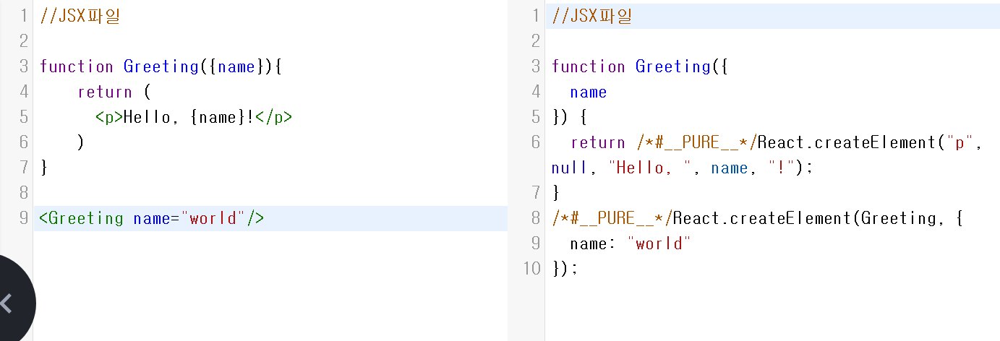
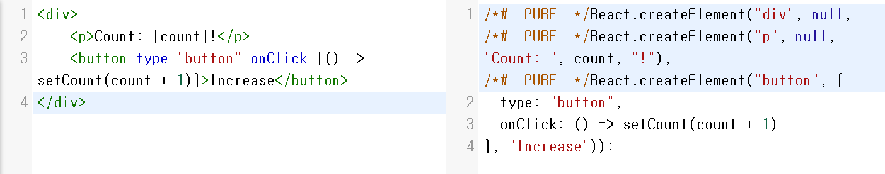

# ❤ JSX

### JSX

JSX는 공식적인 문법이 아니라,  XML와 같이,  ECMAScript에서 확장된 문법이다.\
따라서 jsx로 코드를 작성하면 Babel 혹은여러가지 트랜스파일러들이 표준 ECMAScript로 변환해준다.\
[Babel](https://babeljs.io/repl)은  JSX를 Javascript로 변환된 코드로 사이트에서 바로 확인이 가능하다는 장점 역시 존재한다.

[React-JSX 소개](https://ko.reactjs.org/docs/introducing-jsx.html)\
JSX는 React에서 나왔지만 React에서만 쓰는 것은 아니다. \
Vue, Soildjs와 같이다른 프레임워크에서도 쓸 수 있다.\


### Example 1.

JSX 코드

```jsx
<p>Hello, world!</p>
```

Babel에서변환된 JS 코드

```jsx
React.createElement("p", null, "Hello, world!");

```

### Example 2.

<figure><figcaption></figcaption></figure>

보면 유추할 수 있듯,  name="world"라고 내려주면 자동으로 {  name: "world" } 로 변환되었다\
이 이유는 아마도 React.createElement의 두번째 인자는 프롭스, 세번째 인자는 안의 내용임을 알수 있다.


### Example 3.&#x20;


JSX 코드

```jsx
<Button type="submit">Send</Button>
```

변환된 JS 코드

```jsx
React.createElement(Button, { type: "submit" }, "Send");
```


### Example 4.

<figure><figcaption></figcaption></figure>

### React Element

