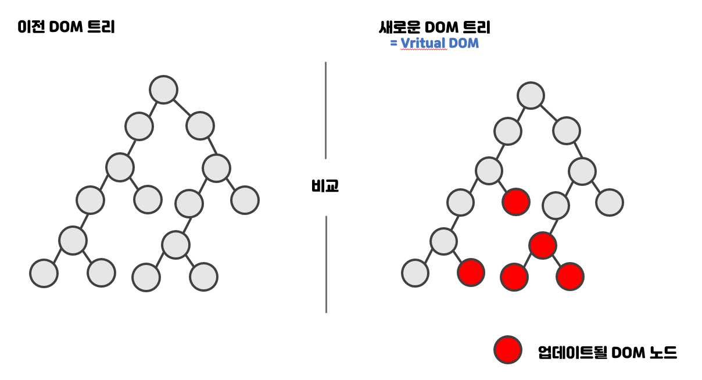

# ❤ JSX

### JSX

JSX는 공식적인 문법이 아니라,  XML와 같이,  ECMAScript에서 확장된 문법이다.\
따라서 jsx로 코드를 작성하면 Babel 혹은여러가지 트랜스파일러들이 표준 ECMAScript로 변환해준다.\
[Babel](https://babeljs.io/repl)은  JSX를 Javascript로 변환된 코드로 사이트에서 바로 확인이 가능하다는 장점 역시 존재한다.

[React-JSX 소개](https://ko.reactjs.org/docs/introducing-jsx.html)\
JSX는 React에서 나왔지만 React에서만 쓰는 것은 아니다. \
Vue, Soildjs와 같이다른 프레임워크에서도 쓸 수 있다.\


### JSX는 Syntactic sugar인가.

자바스크립트에서도 클래스가 기존 프로토타입 기반 패턴을 클래스 기반 패턴처럼 사용하는 \
문법적 설탕(Syntactic sugar)이라는 말이 있다.

jsx도 javascript의 createElement 함수를 html의 시멘틱 태그처럼 간단하게 표현 가능한 \
문법적 설탕을 제공한다.

* 각 JSX 엘리먼트는 단지 React.createElement()를 호출하는 편리한 문법에 불과하다.
  * 즉, JSX는 `React.createElement`의 `Syntax Sugar`이다.
* JSX를 사용할 경우 React.createElement()를 직접 호출하는 일은 거의 없다.


```javascript
React.createElement(
  type,
  [props],
  [...children]
)
```

아래의 예를 통해 알아보자.

### Example 1.

JSX 코드

```jsx
<p>Hello, world!</p>
```

Babel에서변환된 JS 코드

```jsx
React.createElement("p", null, "Hello, world!");
```

### Example 2.

<figure><figcaption></figcaption></figure>

보면 유추할 수 있듯,  name="world"라고 내려주면 자동으로 {  name: "world" } 로 변환되었다\
이 이유는 아마도 React.createElement의 두번째 인자는 프롭스, 세번째 인자는 안의 내용임을 알수 있다.


### Example 3.&#x20;


JSX 코드

```jsx
<Button type="submit">Send</Button>
```

변환된 JS 코드

```jsx
React.createElement(Button, { type: "submit" }, "Send");
```


### Example 4.

<figure><figcaption></figcaption></figure>

### React Element

JSX는 React에 있는 createElement로 코드변환시켜준다.\
JSX없이도 React를 사용할 수 있지만 JSX로 리액트 어플리케이션을 작성하는 것이 \
가독성, 생산성 측면에서 모두 좋다고 생각한다.

JSX는 React Element 트리를 갱신하는데 쓸 수 있다.


### VDOM (Virtual DOM)

DOM(Document Object Model)은 웹 페이지를 이루는 \
태그들을 자바스크립트가 이용할 수 있게끔 브라우저가 트리구조로 만든 객체 모델을 의미한다.

가상 돔(Virtual DOM) 실제 DOM에 접근하여 조작하는 대신,\
이를 추상화한 자바스크립트 객체를 구성하여 사용한다.\
React에서는 DOM을 조작하는 것이 아니라 Virtual DOM Tree를 만들어서 사용한다.

만일 데이트가 업데이트 된다면 전체 UI를 가상돔에 먼저 리렌더링 후, 이전 가상돔에 있던 내용과 현재의 내용을 비교하려, 바뀐부분만 실제 DOM과 동기화를 해준다, \
이 과정을 재조정(Reconciliation)이라고 한다.

<figure><figcaption></figcaption></figure>


## Reconciliation

리액트는 DOM보다 월등하게 빠르다긴 보단, 유지보수하기에 매우 용이하다

> 리액트는 유지보수하기 훨씬 좋기 때문에 사용하는 것이다. 속도도 DOM에 비해 월등이 빠르다기보다는 충분히 빠르다.

또한 VDOM을 사용할 경우 선언적 API를 사용할수 있기때문에 유용하기도하다.

