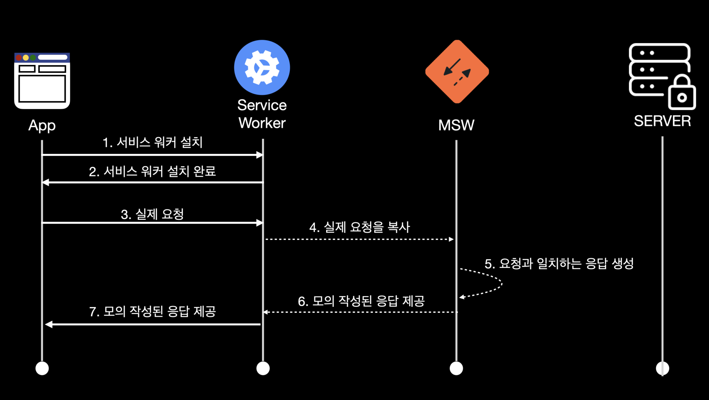

# 💚 PlayWright

## [Playwright](https://playwright.dev/docs/intro/)

하나의 API로 모든 최신 브라우저(크로미움, 파이어폭스, 웹킷)에서 빠르고, 안정적인 자동화를 지원하는 MS에서 만든 자동화 도구다. 안타깝게도 레거시 Edge나 IE11은 지원하지 않지만 다음과 같이 다양한 장점이 있다.

### E2E Test

E2E(End-to-End) 테스트란 사용자 중심으로 처음부터 끝까지 어플리케이션 흐름을 테스트하는 소프트웨어 테스트 방법 중 하나다. \
E2E 테스트의 목적은 실제 사용자 시나리오를 시뮬레이션하고 어플리케이션 구성 요소의 통합 및 데이터 무결성을 검증하는 것 이다.

만약에 E2E 테스트를 진행하지 않으면 어플리케이션 최종 테스트를 진행할 방법이 없으며, 어플리케이션 사용자가 어플리케이션에 대한 신뢰가 떨어지고 사용의 불편함을 느낄 수 있다.

<figure><figcaption></figcaption></figure>

## Headless Chrome

크롬은 GUI(Graphical User Interface) 없이 코드를 구현하는 헤드리스 자동화 테스트를 지원한다. Linux, macOS, Windows에서 사용할 수 있다.

### Headless Browser란?

> 사용자 인터페이스가 없는 웹 브라우저로, 다른 브라우저와 동일하지만 화면에서는 아무것도 볼 수 없다. (백그라운드에서 작동하는 브라우저)

Playwright도 Headless 브라우저를 기반이다.

브라우저 창을 띄우지 않고 백그라운드에서 실행되는 브라우저를 말합니다. 이를 통해 자동화 테스트나 크롤링 작업 등을 수행할 수 있다.\
Playwright는 headless 브라우저뿐만 아니라, GUI 브라우저에서도 동작할 수 있어서 \
더욱 다양한 상황에서 활용할 수 있다.


### Headless 브라우저의 장점

* 꼭 브라우저를 보지 않아도 테스트가 성공적으로 실행되는지만 지켜볼 경우에 사용할 수 있다. 다른 앱과 더불어 병렬적으로 테스트를 실행해야 할 때 UI 기반 브라우저는 메모리를 많이 사용하므로 헤드리스 브라우저를 사용하는 것이 좋다.
* 실제로 브라우저를 띄우고 테스트 하는것보다는 테스트 속도도 더 빠르다.

```bash
CI-true npx playwright test
```

## Puppeteer

Puppeteer 또한 E2E 테스트를 위해 만들어진 테스팅 도구이다.\
Playwright 이전에 Headless Chrome을 기반으로 만들어졌다. chrome과 Chromium 브라우저에 특화되어 있다.\
크롤링할때 사용해보긴 했지만 E2E테스트를 위한 테스팅 도구라는건 처음이다.

Puppeteer보다 Playwright가 더 가볍고 편하며 playwright은 firefox, safari와 같은 다른 브라우저도 지원하여 멀티 브라우저 테스트를 수행하기 더 쉽다.\
Playwright 사용하기

Playwright은 테스팅을 위한 api들을 제공한다.


```bash
npm i -D @playwright/test eslint-plugin-playwright
```

&#x20;express 서버는 당연히 켜놓고 시작해야한다.\
그리고 playwright config 파일도 만들어야 한다.

```javascript
// playwright.config.ts
import { PlaywrightTestConfig } from "@playwright/test";

const config: PlaywrightTestConfig = {
  testDir: "./tests",
  retries: 0,
  use: {
    channel: "chrome",
    baseURL: "http://localhost:8080",
    //ci 환경이 잡혀있으면 headless로 띄운다.
    headless: !!process.env.CI,
    screenshot: "only-on-failure",
  },
};

export default config;
```

config 파일에서 설정한대로 test 디렉토리를 만들고 \
그 안에 home.spec.ts 파일에 테스트를 작성한다.

```javascript
//home.spec,ts

import { test, expect } from "@playwright/test";

test("Filter products", async ({ page }) => {
  await page.goto("/");

  await expect(page.getByText("Apple")).toBeVisible();

  const searchInput = page.getByLabel("Search");

  await searchInput.fill("a");

  await expect(page.getByText("Apple")).toBeVisible();

  await searchInput.fill("aa");

  await expect(page.getByText("Apple")).toBeHidden();
});

test("Click the “Increase” button", async ({ page }) => {
  await page.goto("/");

  const count = 13;

  // 전부 다 클릭되었을 때 다음 것 실행하기 (Promise가 리턴되려면  forEach가 아니라 map써야함)
  await Promise.all(
    [...Array(count)].map(async () => {
      await page.getByText("Increase").click();
    })
  );

  await expect(page.getByText(`${count}`)).toBeVisible();
});
```

같은 폴더 경로에 eslintrc.js 파일도 만들어주면 좋다.

```javascript
module.exports = {
  env: {
    // jest 끔
    jest: false,
  },
  extends: ["plugin:playwright/playwright-test"],
  rules: {
    // 아래 설정은 mocks폴더에서도 하면 좋음
    "import/no-extraneous-dependencies": "off",
  },
};
```

```bash
npx playwright test
```

test-results 디렉터리에는 에러가 생겼을 때의 스크린샷이 담긴다. \
이 디렉터리도 gitignore 파일에 적어줘야함.

## [CodeceptJs](https://codecept.io/)

[아샬님의 인수테스트 작성하기](https://www.youtube.com/watch?v=Q6TkggwPzFA)

> node.js 기반의 E2E 테스트 프레임워크이다.

간단한 서비스들은 codeceptjs로도 E2E 테스트가 가능하다. \
&#x20;그래서 과제 테스팅할때 신기하기도하고 재밋기도하고 편했다.

```javascript
Scenario("check Welcome page on site", ({ I }) => {
  I.amOnPage("/");
  I.see("Welcome");
});
```

